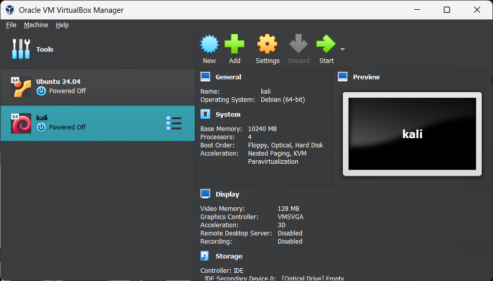
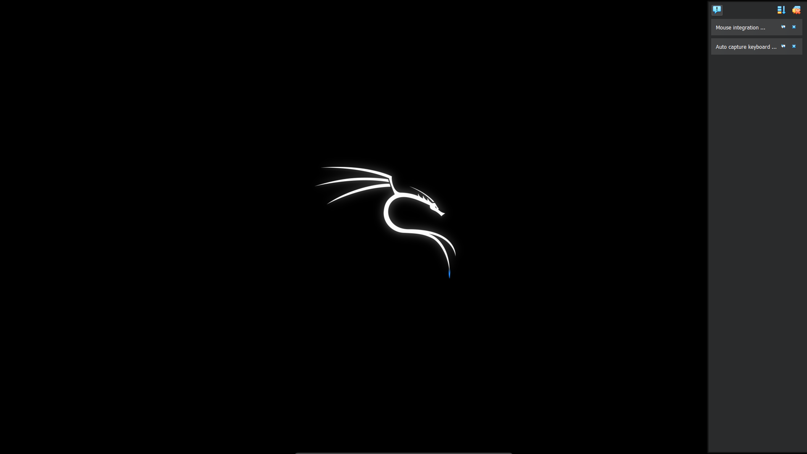
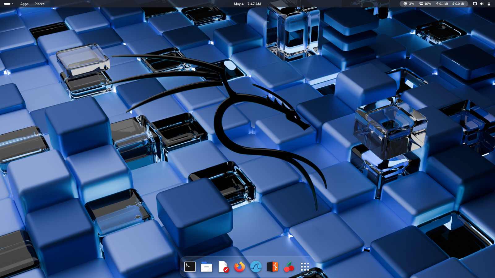
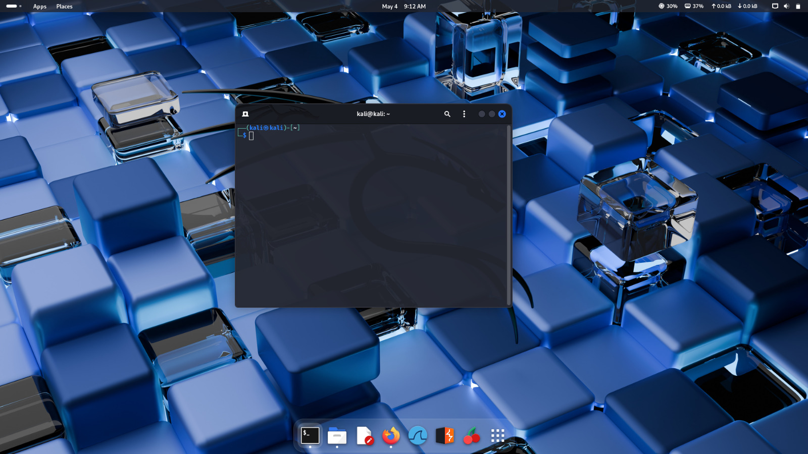

## Day 1 - Pentest Lab Setup

🔧 Installed VirtualBox  
🐱‍💻 Installed Kali Linux ISO  
🖥️ Explored Kali Interface:  
- Opened Terminal  
- Launched Firefox Browser  
- Started Burp Suite

### Screenshots

